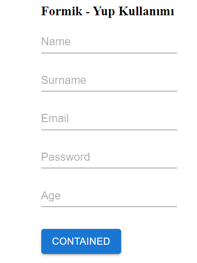
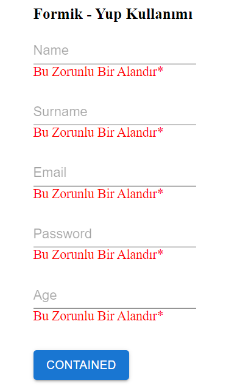

React Formik Yup Kullanımı

Açıklama : Formk Yup Yapısını Kullanarak Formlarınızda validation işlemlerinizi daha rahat bir şekilde yapabilirsiniz ve bu paket sayesinde kodunuz daha okunabilir olur.

images:

